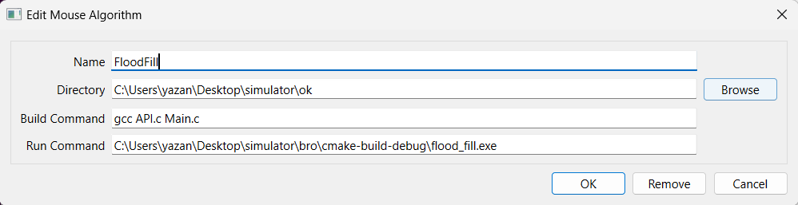
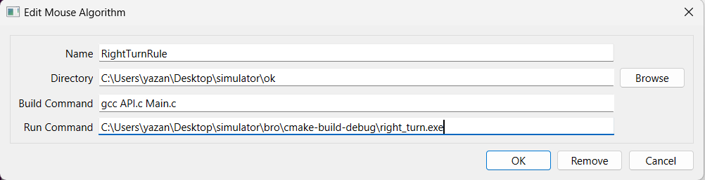

# Maze-solving Algorithms simulation in C
## Description
This project simulates two classic maze-solving algorithms using C: [Flood Fill algorithm](https://en.wikipedia.org/wiki/Flood_fill) 
and [Right Turn Rule algorithm](https://en.wikipedia.org/wiki/Maze_solving_algorithm#Wall_follower).  
The simulator demonstrates how these algorithms can be applied to navigate and solve mazes efficiently. 
Each algorithm is implemented with its own header files and drivers, making it easy to switch between 
and test different strategies.
For use with [mackorone/mms](https://github.com/mackorone/mms), a Micromouse simulator.

## Algorithms

### Right Turn Rule Algorithm
The Right Turn Rule algorithm is a simple maze-solving strategy where the robot follows the right-hand wall of the maze. The robot will:
1. Move forward if there is no wall in front.
2. Turn right if there is no wall to the right and move forward.
3. Turn left if there is a wall in front and to the right, then move forward.
4. Turn around if there are walls in front, to the right, and to the left.

This algorithm is easy to implement but may not find the shortest path in a complex maze.

### Flood Fill Algorithm
The Flood Fill algorithm is a more advanced maze-solving strategy that ensures the robot finds the shortest path to the goal. The algorithm works by:
1. Initializing a flood matrix where each cell's value represents the number of steps from the goal.
2. Initializing a maze matrix where each cell's value represents the configuration of the cell. This essentially
	 helps the mouse in memorizing the configuration of the walls in each cell
3. Propagating values from the goal outward, updating each flood matrix cell's value based on its neighbors, and taking into account whether
	 the mouse can move from a cell to an adjacent based on the maze matrix.
4. Navigating the maze by moving to the adjacent cell with the lowest value in the flood matrix.

This algorithm is more efficient for solving complex mazes as it guarantees the shortest path.

## File Structure
- **API.c / API.h:** Contains the API functions for the simulator.
- **CMakeLists.txt:** CMake build configuration file.
- **Flood_fill_driver.c:** Driver file for executing the Flood Fill algorithm.
- **Robot.c / Robot.h:** Contains the implementation and definitions related to the robot.
- **Stack.c / Stack.h:** Stack implementation used by the algorithms.
- **flood_fill.c / flood_fill.h:** Implementation and definitions for the Flood Fill algorithm.
- **right_turn_driver.c:** Driver file for executing the Right Turn Rule algorithm.

## Usage with the Simulator
1. Download [the Micromouse simulator](https://github.com/mackorone/mms#download)
2. Run the simulator and click the "+" button to configure a new algorithm
3. Enter the config for your algorithm (name, directory, and run command)
4. Click the "Run" button

## Examples 
### Flood fill setup: 

### Right turn rule setup: 

## Contributors
- [Yazan AbuAloun](https://github.com/yazan6546)
- [Noor Mouadi](https://github.com/NoorMouadi)
- [Abdulhameed Awad](https://github.com/ABOUSHI121)

